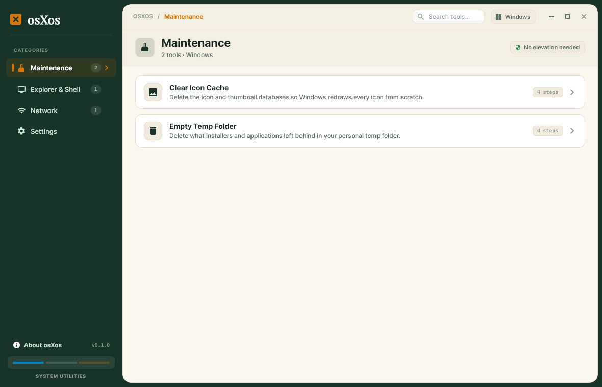
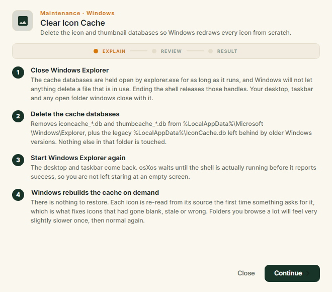
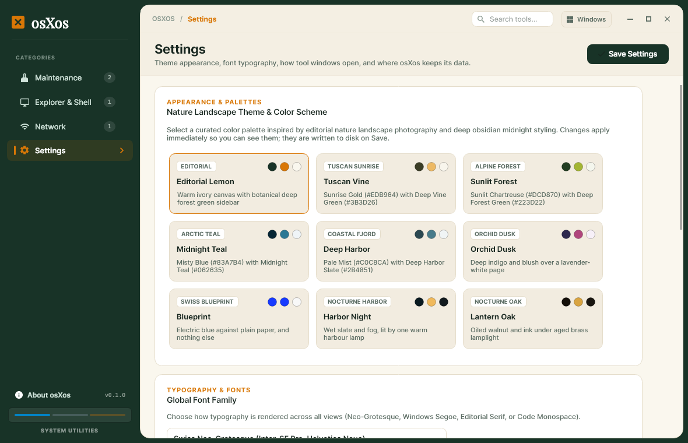

# osXos


**osXos** collects the small maintenance jobs you would otherwise do from a terminal — clearing the icon cache, emptying the temp folder, flushing DNS — and gives each one a window that explains exactly what it will do before it does it.

One codebase, three builds. osXos shows the tools for the operating system it is running on, with that OS's own category names.

Built with **Avalonia UI** and **C#**, sharing its design language with [Cogas](https://github.com/fezcode/Cogas).



## How a tool works

Every tool opens in its own window with three stages.



| Stage | What it is |
|---|---|
| **Explain** | Numbered steps: what the tool will do, why each step is necessary, and what it costs you. Opening the window changes nothing — it is documentation you can read and close. |
| **Review** | What was actually found on *this* machine: exact file paths, sizes, the reclaimable total, the precise commands that will run. A gold banner for anything that restarts your shell. |
| **Result** | What happened, line by line, including anything that could not be done and why. |

The inspection runs while you read the steps, so Review is there when you get to it. **Nothing on your system changes until you press the button on Review.**

When a tool cannot do anything useful here — no cache to clear, a resolver it does not recognise — Review says so plainly and the action is disabled. osXos never reports success for a job it did not do.

## Menu bar

osXos describes itself as a menu once — an **osXos** menu, **Tools** (every tool, grouped by category, two clicks from anywhere), **View** and **Help** — and then draws it wherever the platform keeps menus:

| OS | Where the menus go |
|---|---|
| **macOS** | the real system menu bar along the top of the screen. The osXos menu becomes the application menu, so About, Settings (⌘,) and Quit (⌘Q) land where macOS users expect them |
| **Windows** | Windows has no menu bar of its own, so osXos publishes to [Hisashi](https://github.com/fezcode/Hisashi) over the hoswl pipe. Nothing happens if Hisashi is not running — the client just retries quietly |
| **Linux** | offered to the desktop's global menu over DBus, where one exists (KDE, Unity, GNOME with AppIndicator). Nothing happens and nothing breaks where one does not |

**Settings → Menu Bar** turns it off on any of the three. The card explains what that means on the OS you are actually running.

## Tools

Every tool shipped today runs entirely within your own user account: **no UAC, no sudo, no polkit.** A test enforces it, so this stays true by accident of nobody noticing.

Some future tools will need administrator rights, and the plumbing is in place for them. A tool that needs them declares it, the Review stage says so — naming the prompt the OS is about to show — and osXos elevates that one command rather than relaunching itself as administrator. The category header tells you which way round it is.

### Windows

| Category | Tool | |
|---|---|---|
| Maintenance | **Clear Icon Cache** | Ends Explorer, deletes `iconcache_*.db`, `thumbcache_*.db` and the legacy `IconCache.db`, restarts Explorer |
| Maintenance | Empty Temp Folder | `%TEMP%`, skipping and reporting anything still in use |
| Explorer & Shell | Show Hidden Files & Extensions | Flips `Hidden` and `HideFileExt`, then broadcasts `SHChangeNotify`. Run it twice to undo |
| Network | Flush DNS Cache | `ipconfig /flushdns` |

### macOS

| Category | Tool | |
|---|---|---|
| Maintenance | Clear Icon Services Cache | Removes `~/Library/Caches/com.apple.iconservices.store`, restarts Dock and Finder |
| Maintenance | Clear User Caches | `~/Library/Caches`, per-bundle sizes |
| Finder & Dock | Show Hidden Files in Finder | `defaults write com.apple.finder AppleShowAllFiles`, then `killall Finder` |
| Network | Flush DNS Cache | `dscacheutil -flushcache`. The `mDNSResponder` half needs sudo, so osXos shows you that command rather than running it |

### Linux

| Category | Tool | |
|---|---|---|
| Maintenance | Clear Thumbnail Cache | `$XDG_CACHE_HOME/thumbnails` — `normal/`, `large/` and `fail/` |
| Maintenance | Clear User Cache | `$XDG_CACHE_HOME`, per-application sizes |
| Desktop & Shell | Rebuild Icon Cache | `gtk-update-icon-cache -f -t` per theme under `$XDG_DATA_HOME/icons` |
| Network | Flush DNS Cache | `resolvectl flush-caches`, and an honest refusal if systemd-resolved is not what is resolving here |

### Categories

Each OS defines six categories — Maintenance, a shell one (Explorer & Shell, Finder & Dock, Desktop & Shell), System, Network, and then Privacy and Developer on Windows and macOS or Packages and Services on Linux. **A category only appears once a tool claims it**, so there are no empty pages anywhere in the app, and a category shows up by itself the day its first tool lands.



## Themes

Nine editorial palettes and seven typefaces, switchable live, shared with Cogas. Settings, theme and behaviour live in a plain JSON file you can read and edit:

| OS | Location |
|---|---|
| Windows | `%APPDATA%\fezcode\osxos\settings.json` |
| macOS | `~/Library/Application Support/fezcode/osxos/settings.json` |
| Linux | `~/.config/fezcode/osxos/settings.json` |

**Settings → Local Data** shows the exact path and opens the folder. Nothing is stored anywhere else, and osXos makes no network requests at all.

## Releases

Pre-built binaries for all three platforms are on the [Releases](https://github.com/fezcode/osXos/releases) page — a Windows installer, and tarballs for macOS (Apple Silicon and Intel) and Linux.

## Build requirements

- **.NET 8.0 SDK**
- [Forge](https://github.com/fezcode/Forge) checked out beside this repo, only to build the Windows installer

## Building & running

```powershell
git clone https://github.com/fezcode/osXos.git
cd osXos
dotnet run
```

Run the tests — the tool catalogue, file sweeping, settings, the menu tree and the exact commands every shell-driven tool builds. No window is shown:

```powershell
dotnet test Tests/osXos.Tests
```

`Tests/osXos.Shots` is a development harness that renders the real windows off-screen with Skia, so the design can be reviewed without a window appearing on anyone's desktop. It is not part of the app.

```powershell
dotnet run --project Tests/osXos.Shots -- out
```

## Releasing

The version lives in `osXos.csproj` and `forge.toml`. `version.ps1` keeps them in lockstep so a build can never advertise one version and install another. `-RequireBuild` also checks the published binary under `dist/`.

```powershell
.\version.ps1                 # report every location and whether they agree
.\version.ps1 -RequireBuild   # also check the published dist/ binary
.\version.ps1 -Bump patch     # 0.1.0 -> 0.1.1 everywhere, then verify
.\version.ps1 -Set 1.0.0

.\build.ps1                            # tests, then publish win-x64 to dist/
.\build.ps1 -Rid linux-x64 -Package    # publish and tar
.\build.ps1 -All                       # every release RID, tarred
.\installer.ps1                        # build.ps1 + version check + Forge
.\installer.ps1 -SkipBuild             # repackage the existing publish output
```

Forge targets Windows, so `installer.ps1` produces `dist/installer/osXos-Setup-<version>.exe` and the macOS and Linux builds ship as tarballs from `build.ps1 -Package`.

## Verification status

The four Windows tools were run and verified on Windows 11. **The macOS and Linux tools have not been run end to end** — they were developed and unit-tested for everything that does not need their OS (paths built, exact argv, output parsing, blocked-state handling), but no Mac or Linux machine was available. Treat those eight as untested against a real system until someone runs them.

The same goes for the menu bar. The tree is built and converted for real on both paths — the native `NativeMenu` is constructed and walked in the screenshot harness, and the hoswl translation is unit-tested — but **it has not been seen in the macOS menu bar or in a Linux global menu**, and Hisashi was not running here to confirm the Windows path end to end.

## Artwork

Both pieces are generated, so neither drifts from the palette:

| Script | Produces | Needs |
|---|---|---|
| `scripts/make-icon.py` | `Assets/icon.svg`, PNG previews, the seven-resolution Windows ICO | Pillow |
| `scripts/make-banner.py` | `Assets/banner.svg` — the banner above | fonttools |

The banner's wordmark is emitted as real glyph outlines rather than a `<text>` element. GitHub renders README SVGs inside an ``, which cannot load a font, so a text element would show Playfair here and something else everywhere else.

The app embeds the icon assets, so the generators are only needed when the design changes. They live in `scripts/` rather than Cogas's `tools/` because `Tools/` here is source, and Windows treats the two as one directory.

## License

MIT
