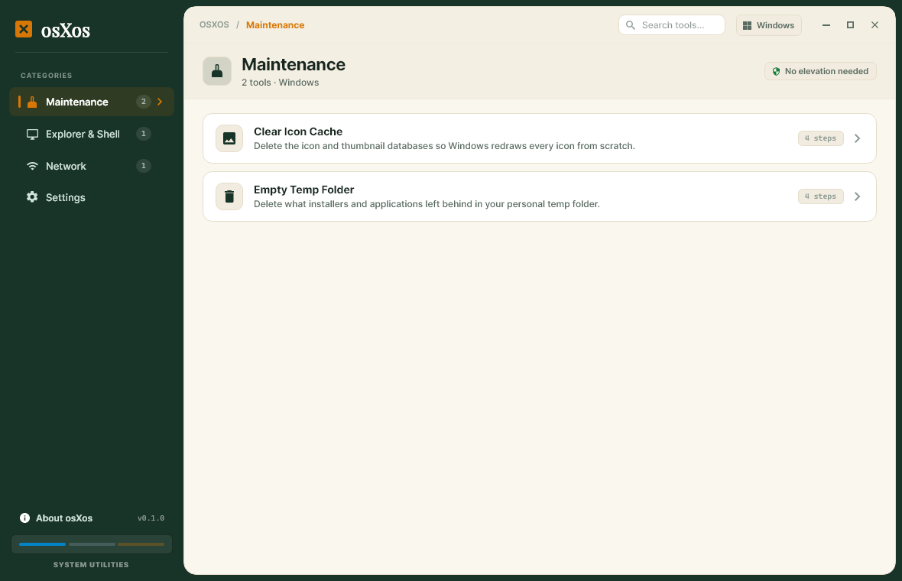
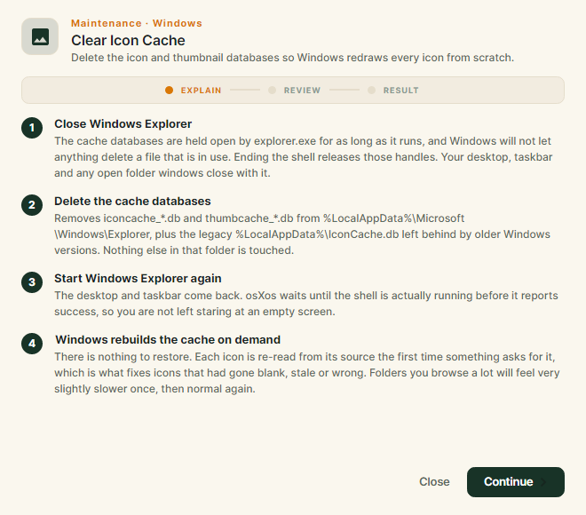
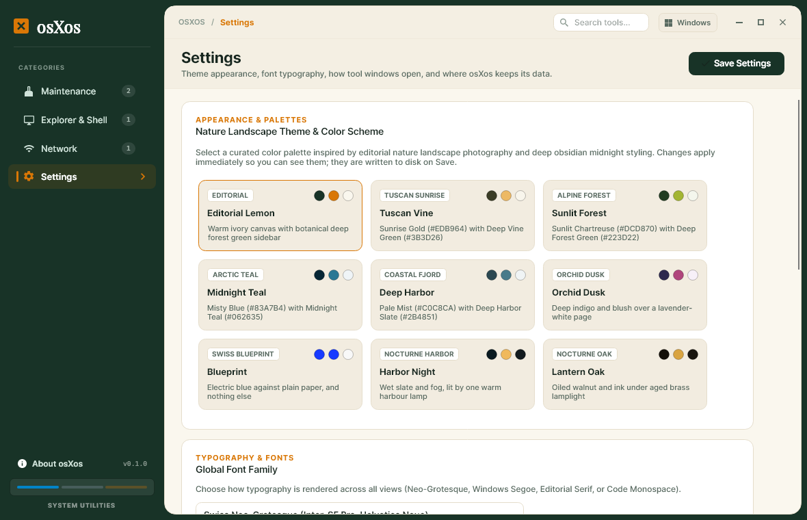

# osXos


**osXos** collects the small maintenance jobs you would otherwise do from a terminal — clearing the icon cache, emptying the temp folder, flushing DNS, sweeping up after the AI tools you code with — and gives each one a window that explains exactly what it will do before it does it.

One codebase, three builds. osXos shows the tools for the operating system it is running on, with that OS's own category names.

Built with **Avalonia UI** and **C#**, sharing its design language with [Cogas](https://github.com/fezcode/Cogas).



## How a tool works

Every tool opens in its own window with three stages.



| Stage | What it is |
|---|---|
| **Explain** | Numbered steps: what the tool will do, why each step is necessary, and what it costs you. Opening the window changes nothing — it is documentation you can read and close. |
| **Review** | What was actually found on *this* machine: exact file paths, sizes, the reclaimable total, the precise commands that will run. A gold banner for anything that restarts your shell. |
| **Result** | What happened, line by line, including anything that could not be done and why. |

The inspection runs while you read the steps, so Review is there when you get to it. **Nothing on your system changes until you press the button on Review.**

When a tool cannot do anything useful here — no cache to clear, a resolver it does not recognise — Review says so plainly and the action is disabled. osXos never reports success for a job it did not do.

Tools that only report — Developer Settings Report, PATH Health Check, Startup Apps Report, Failed Services Report — carry a **Read-only** pill on their card. Running one changes nothing.

## All Tools

**All Tools**, at the top of the sidebar, is every tool on one page: a checklist grouped by category, in the spirit of Chris Titus's WinUtil. Each row shows what that tool would do on this machine right now — the same read-only scan its Review stage runs — so the page is itself the review. Tick what you want and press **Run selected**.

- Scans start the first time you open the page, four at a time, never at launch; **Refresh** looks again.
- Reports, and tools with nothing to do, cannot be ticked; each says why.
- Ticking a tool whose run already includes another greys the smaller one out — Remove AI Tool Leftovers includes the other three AI tools, for instance.
- **Run selected** asks once, listing the tools, how many delete permanently, and which will ask for administrator rights.
- Tools then run one at a time, each acting on exactly what the page showed for it. Every row shows queued, running, done or failed with the tool's own result, **Stop after this one** ends the batch early, and whatever ran is scanned again so its row shows the machine as it now is.
- When the batch finishes, a **run report** opens: every tool that ran, whether it succeeded, and everything it said on its own Result stage. **View report** brings it back until the next batch.

## Menu bar

osXos describes itself as a menu once — an **osXos** menu, **Tools** (every tool, grouped by category, two clicks from anywhere), **View** and **Help** — and then draws it wherever the platform keeps menus:

| OS | Where the menus go |
|---|---|
| **macOS** | the real system menu bar along the top of the screen. The osXos menu becomes the application menu, so About, Settings (⌘,) and Quit (⌘Q) land where macOS users expect them |
| **Windows** | Windows has no menu bar of its own, so osXos publishes to [Hisashi](https://github.com/fezcode/Hisashi) over the hoswl pipe. Nothing happens if Hisashi is not running — the client just retries quietly |
| **Linux** | offered to the desktop's global menu over DBus, where one exists (KDE, Unity, GNOME with AppIndicator). Nothing happens and nothing breaks where one does not |

**Settings → Menu Bar** turns it off on any of the three. The card explains what that means on the OS you are actually running.

## Tools

Most of osXos runs inside your own user account — no UAC, no sudo, no polkit. The tools that need administrator rights are Clear Windows Update Cache, because the folder is owned by the system and the service holding it has to be stopped first; Clean Package Cache on Linux, because the package manager's download cache is owned by root; Remove AI Sandbox Accounts, because deleting a Windows account always does; and the entries taken from WinUtil that change machine-wide settings — registry tweaks with a value in `HKEY_LOCAL_MACHINE`, and every script, feature and fix, since WinUtil runs those as administrator. Each carries an **Admin** pill, and elevates one command whose every part its Review lists.

A tool that needs rights declares it, the Review stage says so and names the prompt the OS is about to show, and osXos elevates **that one command** rather than relaunching itself as administrator — so the window, your settings and every other tool stay at normal rights. The category header tells you which way round it is (`1 of 4 need administrator`). A test pins the exact list of tools allowed to ask, so one cannot gain elevation quietly.

### Windows

All seven categories, 133 tools — twenty-eight of osXos's own, five tweaks of its own, and a hundred taken from Chris Titus Tech's WinUtil (below).

| Category | Tool | |
|---|---|---|
| Maintenance | **Clear Icon Cache** | Ends Explorer, deletes `iconcache_*.db`, `thumbcache_*.db` and the legacy `IconCache.db`, restarts Explorer |
| Maintenance | Empty Temp Folder | `%TEMP%`, skipping and reporting anything still in use |
| Maintenance | Empty Recycle Bin | Every drive, with the real count and size first. Re-queries afterwards rather than assuming everything went |
| Maintenance | Clear Windows Update Cache | `SoftwareDistribution\Download` — **needs administrator rights** |
| Maintenance | Clear Shader Caches | DirectX `D3DSCache`, NVIDIA `DXCache`/`GLCache`, AMD `DxCache`/`DxcCache`/`VkCache`, Intel's under `LocalLow` |
| Maintenance | Clear Crash Dumps & Error Reports | `%LOCALAPPDATA%\CrashDumps` and your own Windows Error Reporting queue and archive — the folders stay, their contents go |
| Explorer & Shell | Show Hidden Files & Extensions | Flips `Hidden` and `HideFileExt`, then broadcasts `SHChangeNotify`. Run it twice to undo |
| Explorer & Shell | Restart Explorer | The shell on its own, for a stuck taskbar or tray. Deletes nothing |
| Explorer & Shell | Rebuild Open With Lists | Clears the `FileExts` cache so Explorer stops offering uninstalled programs. Leaves `HKEY_CLASSES_ROOT` alone |
| Explorer & Shell | Remove Dead App Associations | Takes only the leftovers of programs that are gone — Open with entries, remembered and offered file types, a default that points at a dead app, your own dead registrations and link handlers — and keeps every working choice. Never an app on a disconnected drive, an installed Store app, or anything machine-wide |
| Explorer & Shell | Classic Right-Click Menu | Windows 11 only: the per-user `InprocServer32` override for the full menu, then an Explorer restart. Run it twice to undo |
| Explorer & Shell | Show Seconds on the Taskbar Clock | `ShowSecondsInSystemClock`, then a settings broadcast |
| Explorer & Shell | Show Full Path in Explorer Titles | `CabinetState\FullPath` — on Windows 11 it shows in the taskbar preview and Alt+Tab |
| Explorer & Shell | Hide the Taskbar | For a desktop run from Hisashi: auto-hide on, the taskbar windows hidden outright, and a small `osXos --hide-taskbar` keeper — started at once and at every sign-in — that hides any new taskbar Explorer makes after a restart, a crash or a monitor being plugged in. Run it twice to undo, auto-hide restored as it was |
| System | Switch Dark / Light Mode | Flips `AppsUseLightTheme` and `SystemUsesLightTheme` together, then broadcasts `ImmersiveColorSet` so the taskbar and open apps redraw. Run it twice to undo |
| System | Startup Apps Report | Both `Run` keys and both Startup folders, each marked enabled or disabled the way Task Manager records it — **read-only** |
| Network | Flush DNS Cache | `ipconfig /flushdns` |
| Privacy | Clear Recent Files & Jump Lists | The Recent folder plus both jump-list stores |
| Privacy | Clear Explorer & Run History | Typed paths, the Explorer search box, and the Run dialog |
| Privacy | Clear Browser Caches | Every profile's disk, script, GPU and service-worker caches in Chrome, Edge, Brave, Vivaldi, Chromium and Firefox. Never cookies, passwords, history or bookmarks |
| Developer | Developer Settings Report | Long path support, Developer Mode, architecture — **read-only** |
| Developer | PATH Health Check | Dead, duplicated and empty PATH entries — **read-only** |
| Developer | Clear Developer Caches | npm, Yarn, Bun, Deno, node-gyp, pip, uv, NuGet, Go build, Cargo and Gradle caches. Never a project folder, Maven's local repository, Go's module cache or pnpm's store |
| AI Assistants | Clear AI Temp Files | Per-session scratchpads, temp folders, and the pasted images and git indexes Codex drops in the temp folder |
| AI Assistants | Clear AI Tool Caches | Everything above, plus logs, sandbox binaries and the installer packages Claude Desktop keeps after updating |
| AI Assistants | Clear AI Assistant History | Stored transcripts. Keeps every `memory/` folder, and every login |
| AI Assistants | **Remove AI Tool Leftovers** | Both of the above plus plugins, extensions, generated images and state databases |
| AI Assistants | Remove AI Sandbox Accounts | The local Windows accounts Codex creates to sandbox its commands — CodexSandboxOffline, CodexSandboxOnline and the CodexSandboxUsers group — with any profile folder. Known names only; **needs administrator rights**. Codex recreates them if you keep using it |

### Windows tweaks

Registry tweaks in the WinUtil mould: each sets a handful of values, shows them all on Review with what they are now and what they become, and **running it again puts every value back**. They sit in the category they belong to, carry an **Admin** pill when a value is machine-wide, and are all on the All Tools page for ticking in bulk.

**osXos's own**, all per-user, none needing administrator rights: Turn Off Bing in Start Search, Turn Off Tips, Suggestions & Ads, Turn Off Advertising ID & Tailored Experiences, Turn Off Copilot (Windows, its taskbar button and Edge's sidebar), and Turn Off Recall & Click to Do.

**From [Chris Titus Tech's WinUtil](https://github.com/ChrisTitusTech/winutil)** (MIT licensed) — thirty-four tweaks, value for value as WinUtil publishes them, generated from its `config/tweaks.json` by `scripts/gen-winutil-tweaks.py`:

| Kind | Tweaks |
|---|---|
| Privacy | Disable Activity History, Disable Consumer Features, Prevent Device Companion Apps, Debloat Microsoft Edge, Debloat Brave Browser |
| Network | Disable Delivery Optimization, Set IPv4 as Preferred, Disable RDP Unsigned File Warnings |
| Explorer & Shell | Enable End Task With Right Click, Enable Start Menu Previous Layout, Disable File Explorer Home and Gallery, Disable System Tray Notifications & Calendar, System Tray Battery Percentage, Scrollbars Always Visible, Window Snapping, Settings Home Page, Logon Screen Acrylic Blur, Disable Lock Screen, Taskbar Search Icon, Taskbar Task View Icon |
| System | Disable Windows Platform Binary Table (WPBT), Set Time to UTC, Disable Background Apps, BSoD Verbose Mode, Logon Verbose Mode, Microsoft Outlook New Version, Mouse Acceleration, Num Lock on Startup, S0 Sleep Network Connectivity, S3 Sleep, Sticky Keys, Game Mode |
| Maintenance / Developer | Disable Storage Sense, Enable Long Paths |

Every write goes through `reg import` of a file osXos writes — exactly what double-clicking a `.reg` file does — elevated only when a value is in `HKEY_LOCAL_MACHINE`. Afterwards each value is read back, and the result reports what the registry actually holds.

**WinUtil's scripts, features, fixes and panels** — sixty-six more entries, generated by `scripts/gen-winutil-scripts.py` with WinUtil's PowerShell embedded word for word:

| Kind | Entries |
|---|---|
| Script tweaks | Disable Telemetry, Disable Location Tracking, Set Services to Manual, Disable Hibernation, Set Visual Effects to Best Performance, Disable Teredo, Disable IPv6, Start Menu Recommendations, Taskbar Centered Icons, Disable Razer Software Auto-Install — all toggles with a state — plus Disable BitLocker, Disable Reserved Storage, Disable Microsoft Store Recommended Search Results, Disable Logitech Download Assistant Auto-Install and Disable File Explorer Automatic Folder Discovery, each with an **Undo** tool beside it, and the one-off Create Restore Point, Run Disk Cleanup, Remove Temporary Files and Remove Widgets |
| Features | .NET Framework 2/3/4, Hyper-V, Legacy Media Components, WSL, NFS, Windows Sandbox — each showing whether it is already enabled — plus Registry Backup and Legacy F8 Boot Recovery on/off |
| Fixes | Reset Windows Update, Reset Network, System Corruption Scan (chkdsk, sfc, DISM), NTP Server (pool.ntp.org), OpenSSH Server |
| DNS | Google, Cloudflare (three flavours), OpenDNS, Quad9, AdGuard (two flavours), and Reset to Automatic (DHCP) |
| Windows Update | Default Settings, Security Only (Recommended), Disable |
| Power | Enable Ultimate Performance Power Plan, Restore Default Power Plans |
| Legacy panels | Computer Management, Control Panel, Mouse, Network Connections, Power, Printers, Programs and Features, Region, Security and Maintenance, Sound, System Properties, Time and Date, Firewall, System Restore — these open a window and need nothing |

Each runs the way WinUtil runs it — one elevated PowerShell, so one administrator prompt — but inside osXos's contract: Review lists every value, service start type, feature and the complete script before anything happens; the Result stage shows what the script printed; toggles read their state back afterwards and say if it did not land. A few of WinUtil's own helpers (its logger, progress and Explorer refresh) are supplied as small stand-ins so the scripts run unmodified.

**Every tweak shows its current state** as a pill on its card, in search and on All Tools — *Recall off*, *Enabled*, *Partly applied* — and says **Not on this PC** when what it controls does not exist here: Recall off a Copilot+ PC, Brave when Brave is not installed, a Windows feature this edition does not offer.

**Not taken from WinUtil**, deliberately: the entries that download from the internet — Remove Edge, Remove OneDrive, Windows AI removal, the Adobe block list, O&O ShutUp10++, Sysinternals Autologon, the WinGet reinstall and the CTT PowerShell profile — because osXos makes no network requests; DNS's "Fastest" option, which benchmarks by contacting every provider; Multiplane Overlay, a three-way choice rather than a toggle; and WinUtil's app installer and Windows ISO creator, which are applications of their own. Hidden files, file extensions, dark mode and the classic right-click menu already had osXos tools, so WinUtil's versions are not duplicated.

### macOS

All seven categories, eighteen tools.

| Category | Tool | |
|---|---|---|
| Maintenance | Clear Icon Services Cache | Removes `~/Library/Caches/com.apple.iconservices.store`, restarts Dock and Finder |
| Maintenance | Clear User Caches | `~/Library/Caches`, per-bundle sizes |
| Maintenance | Empty Trash | Counted and emptied through Finder, so osXos never needs Full Disk Access. macOS asks once to allow Automation |
| Maintenance | Reset Quick Look Cache | `qlmanage -r cache`, for stale or blank thumbnails |
| Finder & Dock | Show Hidden Files in Finder | `defaults write com.apple.finder AppleShowAllFiles`, then `killall Finder` |
| Finder & Dock | Show Finder Path & Status Bars | `ShowPathbar` and `ShowStatusBar` together, then `killall Finder` |
| Finder & Dock | Restart Dock | `killall Dock`, for a frozen Dock, Mission Control or Launchpad |
| Finder & Dock | Save Screenshots to Pictures | `com.apple.screencapture location` between `~/Pictures/Screenshots` and the Desktop default |
| System | Switch Dark / Light Mode | Asks System Events to flip `dark mode`, the same switch as System Settings → Appearance. macOS asks once to allow Automation |
| Network | Flush DNS Cache | `dscacheutil -flushcache`. The `mDNSResponder` half needs sudo, so osXos shows you that command rather than running it |
| Privacy | Clear Browser Caches | Chrome, Edge, Brave, Vivaldi, Chromium and Firefox caches under `~/Library`. Never cookies or logins. Safari is left out: its cache is behind Full Disk Access |
| Developer | Clear Developer Caches | The same package-manager caches as on Windows, at their macOS locations |
| Developer | Clear Xcode Build Data | `DerivedData` (emptied), device support files and Xcode's caches. Never Archives |
| Developer | Delete Unavailable Simulators | `xcrun simctl delete unavailable`, after listing each one |
| AI Assistants | Clear AI Temp Files | Per-session scratchpads, temp folders, and the pasted images and git indexes Codex drops in the temp folder |
| AI Assistants | Clear AI Tool Caches | `~/.claude`, `~/.codex`, `~/.gemini`, plus the Claude Desktop and Antigravity caches under `~/Library` |
| AI Assistants | Clear AI Assistant History | Stored transcripts. Keeps every `memory/` folder, and every login |
| AI Assistants | **Remove AI Tool Leftovers** | Both of the above plus plugins, extensions, generated images and state databases |

### Linux

All seven categories, sixteen tools.

| Category | Tool | |
|---|---|---|
| Maintenance | Clear Thumbnail Cache | `$XDG_CACHE_HOME/thumbnails` — `normal/`, `large/` and `fail/` |
| Maintenance | Clear User Cache | `$XDG_CACHE_HOME`, per-application sizes |
| Maintenance | Empty Trash | `$XDG_DATA_HOME/Trash` — `files/`, `info/` and `expunged/` emptied, the folders kept |
| Maintenance | Clear Browser Caches | Chrome, Edge, Brave, Vivaldi, Chromium and Firefox caches under `$XDG_CACHE_HOME` and `~/.config`. Never cookies or logins |
| Desktop & Shell | Rebuild Icon Cache | `gtk-update-icon-cache -f -t` per theme under `$XDG_DATA_HOME/icons` |
| System | Switch Dark / Light Mode | KDE Plasma: `plasma-apply-colorscheme` between Breeze Light and Dark. GNOME and friends: `gsettings` `color-scheme`, plus the GTK theme's `-dark` variant when one is installed |
| Network | Flush DNS Cache | `resolvectl flush-caches`, and an honest refusal if systemd-resolved is not what is resolving here |
| Packages | Clear Developer Caches | npm, Yarn, Bun, Deno, node-gyp, pip, uv, NuGet, Go build, Cargo and Gradle caches |
| Packages | Remove Unused Flatpak Runtimes | `flatpak uninstall --user --unused`. The system installation's command is shown, not run |
| Packages | Clean Package Cache | `apt-get clean`, `dnf clean packages`, `pacman -Sc` or `zypper clean` — **needs administrator rights**, asked for through polkit |
| Services | Restart Audio | `systemctl --user restart` for whichever of PipeWire, WirePlumber and PulseAudio is running |
| Services | Failed Services Report | `systemctl --failed` for your session and the system — **read-only** |
| AI Assistants | Clear AI Temp Files | Per-session scratchpads, temp folders, and the pasted images and git indexes Codex drops in the temp folder |
| AI Assistants | Clear AI Tool Caches | `~/.claude`, `~/.codex`, `~/.gemini`, plus the Claude Desktop and Antigravity caches under `$XDG_CACHE_HOME` |
| AI Assistants | Clear AI Assistant History | Stored transcripts. Keeps every `memory/` folder, and every login |
| AI Assistants | **Remove AI Tool Leftovers** | Both of the above plus plugins, extensions, generated images and state databases |

### What the AI tools will never delete

The four AI Assistants tools work from a fixed list of known locations, never a search for anything AI-shaped under your profile. Four kinds of thing are not on that list at all, so they cannot appear on a Review stage and cannot be deleted by pressing the button on one — including by Remove AI Tool Leftovers:

| Kept | Why |
|---|---|
| Logins — `.credentials.json`, `auth.json`, `oauth_creds.json`, `.sandbox-secrets` | A cleanup tool signing you out of something it does not own is a bug, not a feature |
| Settings — `settings.json`, `config.toml`, `~/.claude.json`, `trustedFolders.json` | You set those |
| Hand-written instruction files and skills — `CLAUDE.md`, `GEMINI.md`, `AGENTS.md`, `skills/` | You wrote those |
| Memory — every `memory/` folder inside `~/.claude/projects`, and `memories_1.sqlite` | Earned over months, and not a record of a conversation |

`~/.claude/projects` is the awkward one, because the transcripts to remove and the memory to keep live in the same folder. Clear AI Assistant History lists each project with the size of its transcripts *alone*, and the memory folder is excluded from the deletion rather than handed over and skipped. A test builds a full fake profile, runs the most aggressive of the four tools over it, and asserts every file in the table above is still there afterwards.

The `app-<version>` folders under `AnthropicClaude` are also deliberately absent: one of them is the copy currently running, and osXos will not guess which. The installer `packages` cache beside them — routinely the largest single entry on the list — is fair game, because Squirrel re-downloads it on demand.

The one place the list holds a wildcard is the system temp folder, where Codex drops every pasted image and snapshot git index loose under its own name. Those are matched by that literal prefix — `codex-clipboard-*.png`, `codex-index-*` — directly inside the temp folder and nowhere below it; a test pins that no pattern can start with the wildcard.

### Categories

Each OS defines seven categories — Maintenance, a shell one (Explorer & Shell, Finder & Dock, Desktop & Shell), System, Network, AI Assistants, and then Privacy and Developer on Windows and macOS or Packages and Services on Linux. **A category only appears once a tool claims it**, so there are no empty pages anywhere in the app, and a category shows up by itself the day its first tool lands. All three platforms now fill all seven.



## Themes

Nine editorial palettes — seven light, two dark — and seven typefaces, switchable live, shared with Cogas.

**Light and dark mode** is the Light/Dark switch at the top of Settings. Each mode keeps its own palette, so switching always lands on the one you picked for it, and like everything else on that page it applies live and is kept on Save.

Settings, theme and behaviour live in a plain JSON file you can read and edit:

| OS | Location |
|---|---|
| Windows | `%APPDATA%\fezcode\osxos\settings.json` |
| macOS | `~/Library/Application Support/fezcode/osxos/settings.json` |
| Linux | `~/.config/fezcode/osxos/settings.json` |

**Settings → Local Data** shows the exact path and opens the folder. Nothing is stored anywhere else, and osXos makes no network requests at all.

## Releases

Pre-built binaries for all three platforms are on the [Releases](https://github.com/fezcode/osXos/releases) page — a Windows installer, and tarballs for macOS (Apple Silicon and Intel) and Linux.

## Build requirements

- **.NET 8.0 SDK**
- [Forge](https://github.com/fezcode/Forge) checked out beside this repo, only to build the Windows installer

## Building & running

```powershell
git clone https://github.com/fezcode/osXos.git
cd osXos
dotnet run
```

Run the tests — the tool catalogue, file sweeping, settings, the menu tree and the exact commands every shell-driven tool builds. No window is shown:

```powershell
dotnet test Tests/osXos.Tests
```

`Tests/osXos.Shots` is a development harness that renders the real windows off-screen with Skia, so the design can be reviewed without a window appearing on anyone's desktop. It is not part of the app.

```powershell
dotnet run --project Tests/osXos.Shots -- out
```

## Releasing

The version lives in `osXos.csproj` and `forge.toml`. `version.ps1` keeps them in lockstep so a build can never advertise one version and install another. `-RequireBuild` also checks the published binary under `dist/`.

```powershell
.\version.ps1                 # report every location and whether they agree
.\version.ps1 -RequireBuild   # also check the published dist/ binary
.\version.ps1 -Bump patch     # 0.1.0 -> 0.1.1 everywhere, then verify
.\version.ps1 -Set 1.0.0

.\build.ps1                            # tests, then publish win-x64 to dist/
.\build.ps1 -Rid linux-x64 -Package    # publish and tar
.\build.ps1 -All                       # every release RID, tarred
.\installer.ps1                        # build.ps1 + version check + Forge
.\installer.ps1 -SkipBuild             # repackage the existing publish output
```

Forge targets Windows, so `installer.ps1` produces `dist/installer/osXos-Setup-<version>.exe` and the macOS and Linux builds ship as tarballs from `build.ps1 -Package`.

## Verification status

The four Windows tools were run and verified on Windows 11. **The macOS and Linux tools have not been run end to end** — they were developed and unit-tested for everything that does not need their OS (paths built, exact argv, output parsing, blocked-state handling), but no Mac or Linux machine was available. Treat those eight as untested against a real system until someone runs them.

The same goes for the menu bar. The tree is built and converted for real on both paths — the native `NativeMenu` is constructed and walked in the screenshot harness, and the hoswl translation is unit-tested — but **it has not been seen in the macOS menu bar or in a Linux global menu**, and Hisashi was not running here to confirm the Windows path end to end.

## Artwork

Both pieces are generated, so neither drifts from the palette:

| Script | Produces | Needs |
|---|---|---|
| `scripts/make-icon.py` | `Assets/icon.svg`, PNG previews, the seven-resolution Windows ICO | Pillow |
| `scripts/make-banner.py` | `Assets/banner.svg` — the banner above | fonttools |

The banner's wordmark is emitted as real glyph outlines rather than a `<text>` element. GitHub renders README SVGs inside an ``, which cannot load a font, so a text element would show Playfair here and something else everywhere else.

The app embeds the icon assets, so the generators are only needed when the design changes. They live in `scripts/` rather than Cogas's `tools/` because `Tools/` here is source, and Windows treats the two as one directory.

## License

MIT
